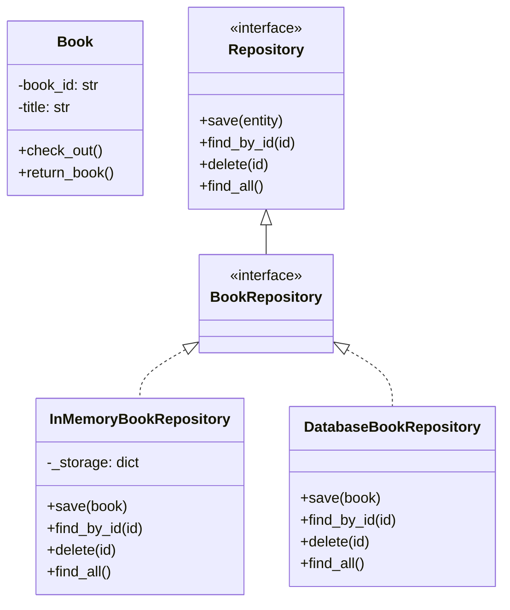

```mermaid
classDiagram
class Book {
  -book_id: str
  -title: str
  +check_out()
  +return_book()
}

class Repository {
  <<interface>>
  +save(entity)
  +find_by_id(id)
  +delete(id)
  +find_all()
}

class BookRepository {
  <<interface>>
}

class InMemoryBookRepository {
  -_storage: dict
  +save(book)
  +find_by_id(id)
  +delete(id)
  +find_all()
}

class DatabaseBookRepository {
  +save(book)
  +find_by_id(id)
  +delete(id)
  +find_all()
}

Repository <|-- BookRepository
BookRepository <|.. InMemoryBookRepository
BookRepository <|.. DatabaseBookRepository
```
