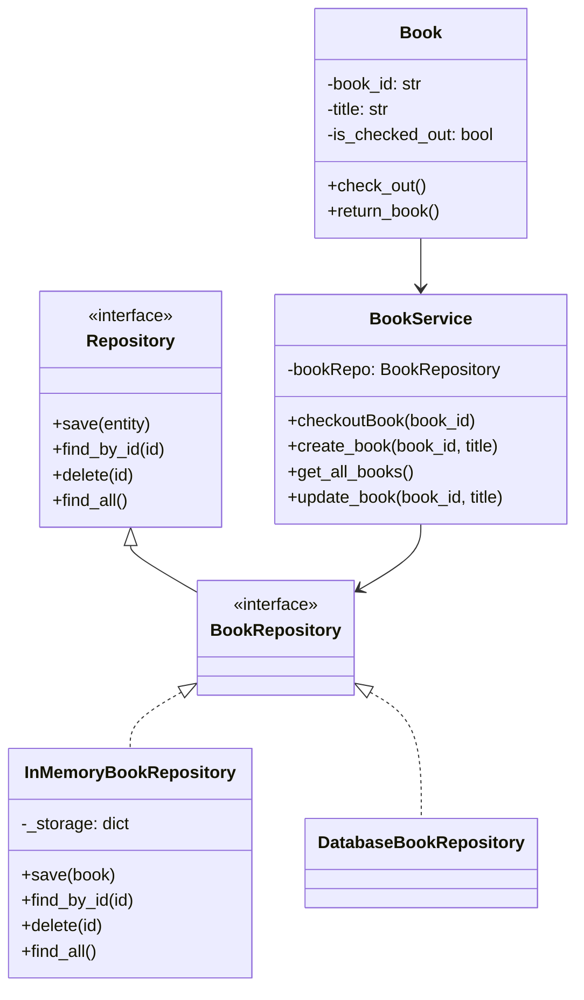

```mermaid
classDiagram
class Book {
  -book_id: str
  -title: str
  -is_checked_out: bool
  +check_out()
  +return_book()
}

class Repository {
  <<interface>>
  +save(entity)
  +find_by_id(id)
  +delete(id)
  +find_all()
}

class BookRepository {
  <<interface>>
}

class InMemoryBookRepository {
  -_storage: dict
  +save(book)
  +find_by_id(id)
  +delete(id)
  +find_all()
}

class BookService {
  -bookRepo: BookRepository
  +checkoutBook(book_id)
  +create_book(book_id, title)
  +get_all_books()
  +update_book(book_id, title)
}

Repository <|-- BookRepository
BookRepository <|.. InMemoryBookRepository
BookRepository <|.. DatabaseBookRepository
Book --> BookService
BookService --> BookRepository
```
